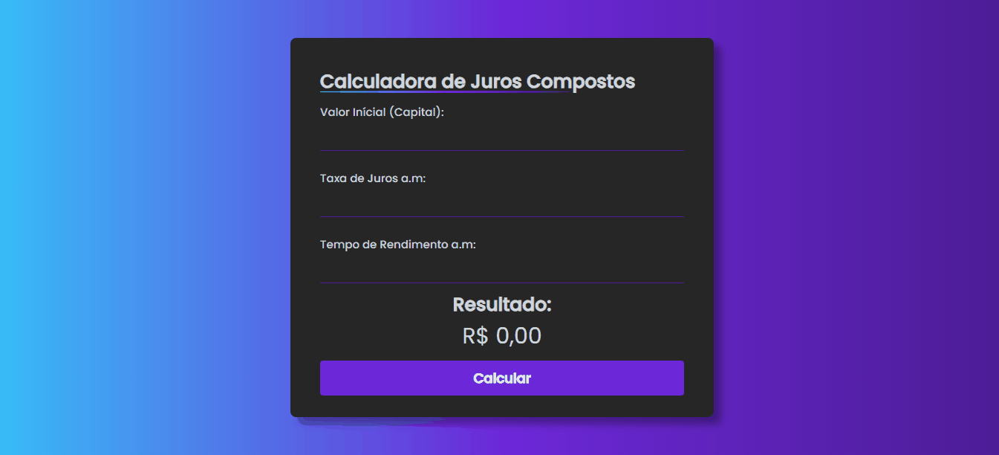

# AivanFees

O projeto AivanFees teve início através da colaboração da Larissa Kich, uma criadora de conteúdo com um canal dedicado a apresentar ideias de projetos no YouTube. A principal funcionalidade do projeto, é servir como uma calculadora de juros compostos, permitindo que os usuários forneçam informações e obtenham respostas sobre o rendimento de seus investimentos, conforme demonstrado no vídeo. Foram utilizadas tecnologias como HTML, CSS e JavaScript, com o uso da responsividade para dispositivos móveis. Além disso, foi utilizado a ferramenta Figma para criar a favicon do projeto, adicionando um "charme" à experiência do usuário.

## Demonstração

## 💻 Tech Stack:

  

## Material
Youtube:
https://youtu.be/9ImvH4bzr-k

## Licença

[MIT License](https://choosealicense.com/licenses/mit/)

## Suporte

Para suporte, mande um email para ivan.rocha.0987@gmail.com ou entre em contato via whatsapp (41) 98468-5317.

## Feedback

Se você tiver algum feedback, por favor enviar para ivan.rocha.0987@gmail.com

## Autores

- [@IvanRocha](https://www.github.com/ivanrocha10)
- [@Larissakich](https://github.com/Larissakich)
## Projeto

  Acesse o "AivanFees" pelo QR:

  

Caso o QR não funcione, acesse <a href="https://ivanrocha10.github.io/AivanFees/">aqui</a>